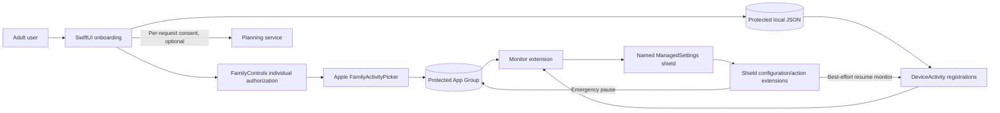

# Cramline Architecture

## Decision

Cramline is an **iOS/iPadOS 16+ native SwiftUI application** with three Screen Time extensions and a Foundation-only domain package. Android ships separately as a **manual focus companion** with no app-control permission. The hosted AI planner is optional and can be absent without degrading the local planner or shield.

## Scheduling architecture considered

| Approach | Tradeoffs | Cost | Setup Complexity |
|---|---|---:|---:|
| On-device `DeviceActivity` + `ManagedSettings` | Only approach that provides the requested Apple system shield; callbacks are not precision timers and require approved entitlements plus device proof | No recurring server cost | High |
| Remote scheduler that tells the app when to shield | Cannot reliably wake an iOS app or apply Screen Time settings remotely; creates unnecessary personal-data and availability risks | Ongoing hosting/push cost | High |
| Foreground-only local timer | Simple and private but cannot deliver scheduled background shields | None | Low |

The build contract already selects the first approach. Cramline does **not** use a server, Manus task, or cloud cron as the enforcement clock.

## Repository map

```text
Packages/CramlineCore/                Foundation-only models and deterministic rules
ios/Cramline/                         SwiftUI host application
ios/Shared/                           App Group state used by host/extensions
ios/Extensions/DeviceActivityMonitor DeviceActivity callbacks and shield application
ios/Extensions/ShieldConfiguration   System shield presentation
ios/Extensions/ShieldAction          Return-to-study and emergency-pause actions
android-companion/                    Permission-free manual Android companion
server/                               Optional no-retention AI planning reference service
docs/                                 Privacy, review, QA, and release evidence
research/                             Dated platform/policy verification memos
```

## Trust boundaries

1. **Host app:** owns onboarding, local plan, StoreKit state, optional telemetry consent, and optional AI request consent.
2. **App Group:** stores only opaque `FamilyActivitySelection`, sprint validity bounds, monitor names, and a minimal active-session snapshot. It is not an analytics bridge.
3. **Screen Time extensions:** link no telemetry or networking SDK. They use generic copy and never persist/export item metadata supplied by the shield API.
4. **Planning service:** accepts a strict schema containing only sprint end date, broad domain, desired hours, preferred times, confidence, and per-request consent. Unknown fields are rejected.
5. **Analytics vendors:** main app only, off by default. Mixpanel initializes only after consent. Firebase Analytics remains disabled in compliance mode because enabled Firebase emits vendor automatic events outside the product allowlist.

## Core state flow



## Fail-open invariants

- Missing, denied, or revoked authorization means **Cannot apply—authorization needed**, never Active.
- The picker expands a category choice into its current concrete app/website tokens, then discards the dynamic category token; more than 50 resulting application tokens prevents saving/applying.
- End session, local deletion, authorization loss, and safety kill switch clear Cramline’s named settings.
- A failed pause-resume registration leaves the shield removed and reports unknown state.
- Subscription, analytics, AI, or network failure never blocks an emergency route.

## Build and deployment

`project.yml` is the XcodeGen source of truth. Bundle IDs, App Group, model endpoint, and vendor token are centralized as build settings. CI generates the Xcode project, tests `CramlineCore`, and compiles the host plus extensions for an iOS Simulator. Simulator CI is development evidence only; release requires entitlement-bearing physical-device and TestFlight validation.
